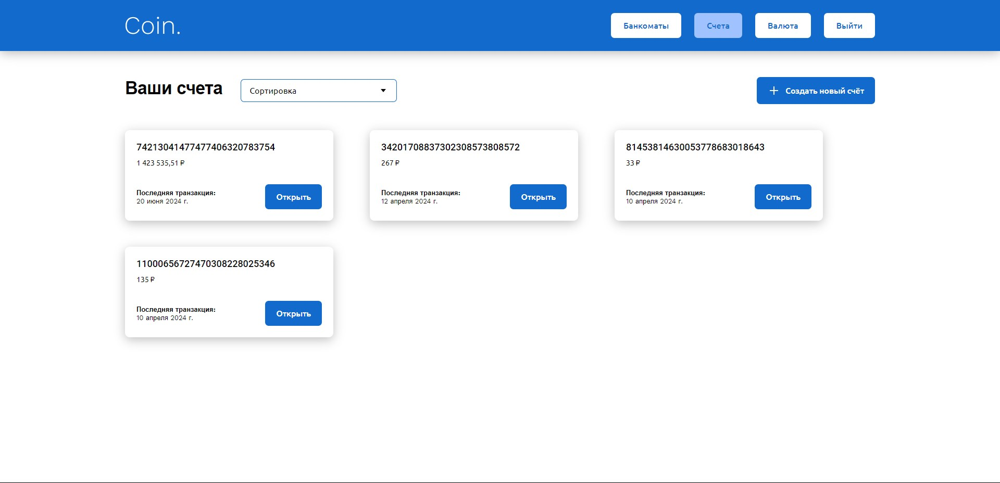

# Банковская система хранения и операций над криптовалютными средствами

## Содержание
- [Технологии](#технологии)
- [Начало работы](#разработка)
- [Тестирование](#тестирование)
- [Визуал](#скриншоты)

## Технологии
  ### Frontend
  - [Webpack](https://webpack.js.org/)
  - [Navigo](https://www.npmjs.com/package/navigo)
  - [Redom](https://www.npmjs.com/package/redom)
  - SCSS
  ### Backend
  - [ExpressJs](https://expressjs.com/ru/)

### Требования
Для установки и запуска проекта, необходим [NodeJS](https://nodejs.org/) v8+.

## Разработка
### Установка зависимостей
Для установки зависимостей, выполните команду:
```sh
$ npm i
```
### Client
#### Запуск Development сервера
Чтобы запустить сервер для разработки, выполните команду:
```sh
npm run dev
```

### Создание билда
Чтобы выполнить production сборку, выполните команду: 
```sh
npm run build
```

### Server
#### Запуск сервера
```sh
npm start
```

## Тестирование
 - [Cypress](https://www.cypress.io/)

Проект покрыт e2e-тестами Cypress. Для их запуска выполните команду:
```sh
npx cypress open
```


## Скриншоты
  
  
  
  
  
  

## Команда проекта
- [Артём Кряквин](https://t.me/art_kryy) — Frontend-developer
